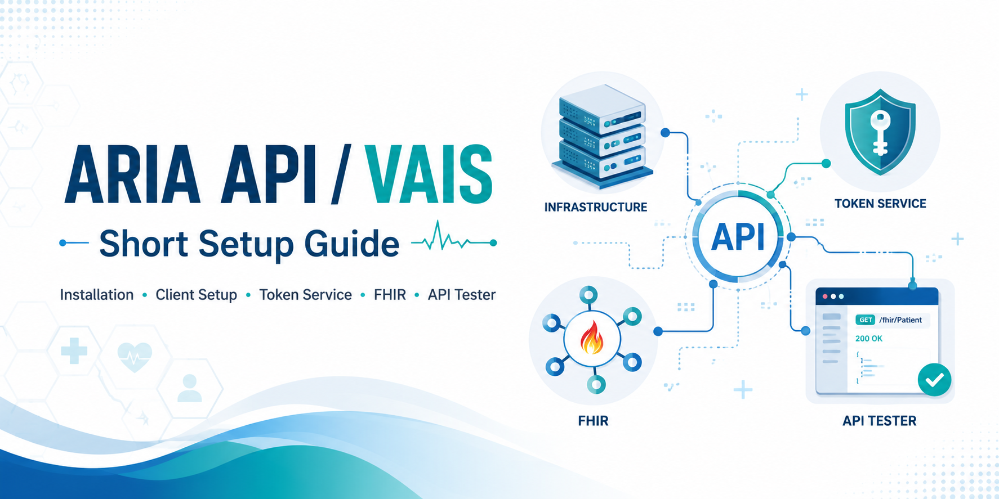

# ARIA API – Customer Repository

Community scripts and resources for accessing the **Varian ARIA API** (VAIS / HL7 FHIR) from a radiation oncology clinic perspective.

---

## Background: The ARIA API and HL7 FHIR

The **ARIA API** is a modern interoperability platform provided by Varian/Siemens Healthineers. It exposes clinical and operational data through a **FHIR-based REST API**, allowing developers to build reporting tools, workflow automation, clinical dashboards, and integrations with external systems.

**FHIR** (Fast Healthcare Interoperability Resources) is the HL7 standard for healthcare data exchange. Data is organized into typed *resources* (Patient, Appointment, DocumentReference, Observation, etc.) accessed via standard HTTP requests.

### Key facts

- The ARIA API is a **licensed feature** – requires a Varian sales order (currently $0 license) and is configured via the **VAIS** (Varian Authentication and Integration Services) administration tool.
- Authentication uses **OAuth 2.0 client credentials flow**: your application exchanges a `client_id` + `client_secret` for a short-lived bearer token.
- **Scopes** define which resources and operations are permitted (e.g. `system/Appointment.rs` for read-only system-level access to appointments). Scopes are downloaded from [MyVarian.com](https://myvarian.com) and entered space-delimited (not comma-delimited).
- The **Patient FHIR ID** follows the format `Patient-<Seriennummer>`, where the number is the ARIA *serial number* — **not** the patient ID (Patientennummer).
- FHIR endpoint: typically `https://<server>:55370/fhir/r4`
- Token endpoint: typically `https://<server>:44333/tokenservice/connect/token`

For a thorough introduction to the ARIA API, VAIS configuration, client setup, and API testing, read:

> 📖 **[ARIA API I: HL7, FHIR and the ARIA API](https://www.gatewayscripts.com/post/aria-api-i-hl7-fhir-and-the-aria-api)**  
> *Matthew Schmidt – Gateway Scripts*

---

## Related Projects

### Treatment Plan Report (Matthew Schmidt / Gateway Scripts)

A C# WPF application demonstrating practical use of the ARIA API to generate treatment plan reports.

> 🔗 **[Gateway-Scripts/TreatmentPlanReport_May2026](https://github.com/Gateway-Scripts/TreatmentPlanReport_May2026)**

---

## Scripts in this Repository

### `aria-fhir-quicktest.ps1`

Quick-start PowerShell script to verify FHIR API access.  
Tests token retrieval and runs read-only FHIR queries for a given patient — useful for validating a new API client configuration.

**Requirements**
- PowerShell 5.1 or later
- `curl.exe` (built-in on Windows 10+)
- A configured ARIA API client with `client_id` and `client_secret`

**Setup**
1. Open `aria-fhir-quicktest.ps1`
2. Fill in the configuration block at the top:
   - `$ClientId`, `$ClientSecret`
   - `$TokenUrl`, `$FhirBase` – replace `<aria-server>` with your server hostname
   - `$PatientId` – format: `Patient-<Seriennummer>` (ARIA serial number, not patient ID)
   - `$Scope` – adjust to the scopes assigned to your client
3. Run in PowerShell

**Queries included**
- Patient resource (direct read)
- Appointments – today and all (filtered by patient)
- DocumentReference
- Condition
- Observation

---

## Further Reading

- [Gateway Scripts Blog](https://www.gatewayscripts.com) – ARIA API series by Matthew Schmidt
- [HL7 FHIR Specification](https://hl7.org/fhir/)
- Setup Guide: see [`ARIA API _ VAIS – Short Setup Guide V3.pdf`](ARIA%20API%20_%20VAIS%20–%20Short%20Setup%20Guide%20V3.pdf) included in this repository
