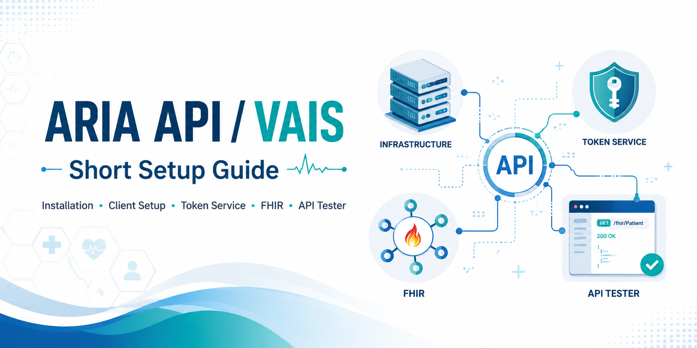
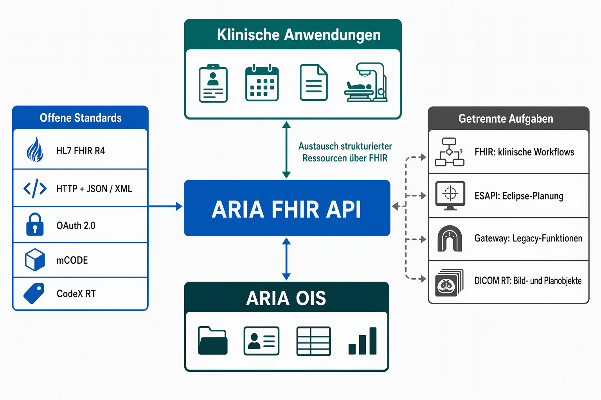

# ARIA API / VAIS



GitHub-sicherer Starter fuer ARIA/VAIS FHIR R4 Workflows. Das Repository enthaelt keine produktiven Servernamen, Tokens, Passwoerter, Client-Secrets, Patientendaten oder lokalen Netzpfade. Produktive Endpunkte und Zugangsdaten werden lokal ueber Umgebung oder `.env` gesetzt.

> **Unabhaengiges Beispielprojekt:** Dieses Repository ist eine persoenliche,
> hersteller- und institutionsunabhaengige technische Referenz. Es ist keine
> offizielle Veroeffentlichung, Freigabe oder Supportleistung eines
> Arbeitgebers, einer Gesundheitseinrichtung oder eines Herstellers. Alle
> lokalen Namen, Kennungen und Workflowbezeichnungen sind synthetisch. Siehe
> [DISCLAIMER.md](DISCLAIMER.md).

## Getting Started

Der kompakte Einstieg liegt als PDF im Repository:

[ARIA API / VAIS - Short Setup Guide V3](docs/ARIA_API_VAIS_Short_Setup_Guide_V3.pdf)

Das PDF beschreibt die Grundidee, lokale Konfiguration, Token-Service, FHIR-Basisaufrufe und den API-Tester auf Uebersichtsebene. Die Codebeispiele hier sind absichtlich schlanker und ohne echte Infrastrukturwerte.

## Inhalt

| Pfad | Zweck |
|---|---|
| `docs/ARIA_API_VAIS_Short_Setup_Guide_V3.pdf` | kurzer Setup- und Orientierungsguide |
| `docs/ARIA-API-ImplementationGuide/` | vollstaendiger statischer ARIA API Implementation Guide als weiterfuehrende Referenz |
| `examples/examples.json/` | JSON-Beispiele und Profile aus dem Implementation Guide |
| `examples/fhir-document-upload/` | nachvollziehbares DocumentReference-Upload-Beispiel mit Dry-Run |
| `examples/fhir-task-create/` | trigger-unabhaengiges ARIA-FHIR-Task-Beispiel mit Gruppen-/Onkologen-Routing und Dry-Run |
| `docs/guides/ARIA_FHIR_API.md` | praktischer FHIR-Einstieg fuer Dokumente, Termine, Tasks und sichere Workflows |
| `docs/guides/ARIA_WEBSERVICE_GATEWAY.md` | Legacy-/Fallbackweg mit sicherer lokaler Access-Key-Handhabung |
| `docs/ARCHITECTURE_AND_CSHARP_PATTERNS.md` | Entscheidung FHIR/ESAPI/Gateway/SQL/DICOM und sichere C#-Muster |
| `notebooks/aria_fhir_github_share.ipynb` | teilbares Notebook ohne lokale IDs, Hostnamen oder gespeicherte API-Antworten |
| `aria_fhir_cli.py` | kleine CLI fuer Token-, Metadata- und Patient-Probes |
| `patient_fhir_query.py` | fokussierte Patient-Suche ueber FHIR |

## Weiterfuehrende Quellen

- [ARIA API Implementation Guide](docs/ARIA-API-ImplementationGuide/index.html)
- [FHIR-Artefakte und JSON-Beispiele](examples/examples.json/)
- [Schnittstellenentscheidung und C#-Praxis](docs/ARCHITECTURE_AND_CSHARP_PATTERNS.md)
- [ARIA API II: Ressourcen, Profile und Operationen](https://www.gatewayscripts.com/post/aria-api-ii-aria-api-resources)
- [ARIA API III: praktische C#-Muster](https://www.gatewayscripts.com/post/aria-api-iii-practical-c-patterns-for-clinical-development)
- [Gateway-Scripts/ARIAAPI_Snippets](https://github.com/Gateway-Scripts/ARIAAPI_Snippets) - Lernbeispiele, keine unveraenderten Produktionsvorlagen
- [HL7 FHIR](https://hl7.org/fhir/), [mCODE](https://hl7.org/fhir/us/mcode/) und [CodeX Radiation Therapy](https://build.fhir.org/ig/HL7/codex-radiation-therapy/)

Die JSON-Beispiele stammen aus dem Implementation Guide. Lokale API-Antworten, produktive Endpunkte und Patientendaten gehoeren nicht in dieses Repository.

## Warum FHIR?

FHIR ist die bevorzugte Integrationsschicht fuer neue klinische und administrative Workflows. Sie verbindet das ARIA-Datenmodell mit offenen, versionierten Standards: HL7 FHIR R4 fuer Ressourcen und Beziehungen, HTTP und JSON/XML fuer den Transport, OAuth2 fuer die Autorisierung sowie mCODE und CodeX Radiation Therapy fuer onkologische beziehungsweise strahlentherapeutische Semantik.

Das macht Integrationen nachvollziehbarer und langfristig anschlussfaehiger als neue proprietaere Punkt-zu-Punkt-Loesungen. ARIA verwendet weiterhin eigene Profile, Extensions, ValueSets und Scopes. Deshalb bleiben der lokal ausgelieferte Implementation Guide und das live gelesene `CapabilityStatement` fuer die konkrete Implementierung verbindlich.



*Mit GPT Image 2 erstelltes Schaubild: FHIR verbindet klinische Anwendungen und ARIA ueber offene Standards. ESAPI, Gateway und DICOM RT behalten klar abgegrenzte Aufgaben.*

## Welche Schnittstelle fuer welche Aufgabe?

| Datenweg | Primaerer Zweck | Typische Beispiele |
|---|---|---|
| ARIA FHIR API | systemuebergreifende klinische und administrative Integration | `Patient`, `Appointment`, `DocumentReference`, `Task`, `Organization`, `Procedure`, `ServiceRequest` |
| ESAPI | Eclipse-nahe Planung, Dosis- und Planobjekte | Plan lesen/pruefen, DVH, Strukturen, freigegebene Planmanipulation |
| ARIA Webservice / Gateway | proprietaere Bestandsfunktionen und lokale Fallbacks | vorhandene operationenbasierte Dokument-Workflows |
| SQL, nur lesend | Extraktion, Reporting und Audit | definierte Abfragen ohne Rueckschreiben |
| DICOM / DICOM RT | Bild- und RT-Objektaustausch | CT, RTSTRUCT, RTPLAN, RTDOSE |

FHIR ersetzt weder ESAPI noch DICOM. C# kann mehrere Wege in einer Anwendung verbinden; Verantwortlichkeiten, Authentisierung und Fehlerbehandlung bleiben dennoch getrennt.

## Lokale Konfiguration

Secrets gehoeren nicht in Code, README, Notebooks oder Commits. Lokal werden diese Variablen erwartet:

```text
ARIA_FHIR_TOKEN_URL=https://<token-host>/tokenservice/connect/token
ARIA_FHIR_BASE_URL=https://<fhir-host>/fhir/r4
ARIA_FHIR_CLIENT_ID=<client-id>
ARIA_FHIR_CLIENT_SECRET=<client-secret>
ARIA_FHIR_SCOPE=system/DocumentReference.cruds system/Patient.rs system/Organization.rs system/ValueSet.rs system/Practitioner.rs
```

Nutze `.env.example` als Vorlage. Eine lokale `.env` bleibt durch `.gitignore` ausgeschlossen.

## FHIR-Hinweise

- `Patient`: bevorzugt ueber `identifier`, `_id`, `family`, `given`, `birthdate` oder `name-or-identifier` suchen; breite Suchen koennen als zu teuer abgelehnt werden.
- `DocumentReference`: Dokumenttypen ueber `ValueSet/$expand` aufloesen, nicht hart codieren.
- `DocumentReference.type.coding` braucht ARIA-Code, System und Display.
- `TemplateName` ist ARIA-Metadaten und unabhaengig vom Dateiformat.
- Kategorie nach Dateityp setzen: PDF als `PDF`, Bilder als `TIF`, Word/DOCX als `Patient Document`.
- `docStatus="preliminary"` entspricht in ARIA nicht genehmigt / pending.

## Schnelle lokale Checks

```powershell
python .\aria_fhir_cli.py --help
python .\examples\fhir-document-upload\fhir_document_upload_example.py --help
python .\examples\fhir-task-create\fhir_task_create_example.py --help
```

Live-Schreiboperationen nur bewusst mit `--execute` ausfuehren.

## FHIR und Webservice getrennt halten

Neue, lokal freigegebene Integrationen verwenden bevorzugt FHIR R4. Der aeltere ARIA Webservice/Gateway bleibt ein eigener operationenbasierter Datenweg fuer Bestand, Fallbacks oder Funktionen, die das installierte FHIR-Profil noch nicht anbietet. Praktische Beispiele und die Unterschiede stehen in den beiden oeffentlichen Leitfaeden unter `docs/guides/`.

Das generische Task-Muster dokumentiert insbesondere die getrennte Verwendung
von `Task.owner` fuer genau einen verantwortlichen Practitioner und
`Task.restriction.recipient` fuer eine Arbeitsgruppe sowie weitere Beteiligte.
Rollen, Gruppen, ActivityDefinitions und Identifier muessen in jeder Umgebung
lokal aufgeloest und fachlich freigegeben werden.

## Git-Workflow

Vor einer Veroeffentlichung werden nur gezielt gepruefte Dateien uebernommen:

```powershell
git status
git diff --check
git add <gepruefte Dateien>
git commit -m "<Aenderung>"
git push origin main
```

Details und Sicherheitsgrenzen stehen in [VERSIONIERUNG.md](VERSIONIERUNG.md).
